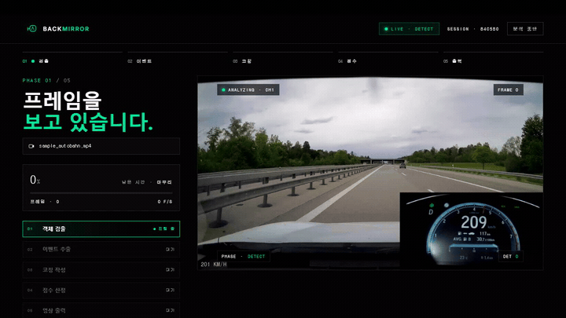

<div align="center">

# 🪞 BackMirror

**블랙박스 영상 한 편을 한 페이지 리포트로 바꾸는 운전 코칭 프로젝트.**
YOLO 객체 검출 + Qwen2.5-VL 코칭 + 이벤트 기반 하이브리드 분석.

<sub>FVE3011 자동차인공지능 Term Project — Team BackMirror</sub>
<br>
<sub>이지원 (Detection) · 박준형 (UI/UX) · 김두훈 (VLM)</sub>

<br>


<br>



<sub>↑ 블랙박스 영상을 올리면 프레임마다 객체를 검출하고, 위험 순간을 실시간으로 분석합니다.</sub>

</div>

---

## 🎬 화면 미리보기

블랙박스 영상을 올리면 **업로드 → 검토 → 라이브 분석 → 시네마틱 리포트**까지 4단계로 흐릅니다.

<table>
<tr>
<td width="50%"><br><sub><b>① IDLE</b> — 에디토리얼 랜딩</sub></td>
<td width="50%"><br><sub><b>② UPLOADED</b> — 영상 검토 + 메타데이터</sub></td>
</tr>
<tr>
<td width="50%"><br><sub><b>③ ANALYZING</b> — 라이브 bbox + HUD + 파이프라인</sub></td>
<td width="50%"><br><sub><b>④ RESULTS</b> — 점수 · 코칭 · 주석 영상</sub></td>
</tr>
</table>

<details>
<summary>📊 결과 리포트 상세 — 키 모먼트 카드 + 카테고리 점수</summary>


</details>

---

## 🚀 빠른 시작

```bash
pip install -r requirements.txt
python app.py
# → http://127.0.0.1:7865
```

영상 없이 파이프라인 전체를 단독 검증하려면:

```bash
python scripts/smoke_pipeline.py
```

README의 4-state 스크린샷을 다시 생성하려면 (앱 실행 중인 별도 터미널에서):

```bash
pip install playwright && python -m playwright install chromium
python scripts/capture_screens.py    # → docs/img/*.png
```

## 🧭 화면 흐름 — 4-state 머신

`gr.Group(visible=…)` 가시성으로 화면 전환을 제어. 각 화면은 단일 HTML 블롭으로
렌더되고 (Gradio Row/Column 컨테이너의 flex/grid 충돌 회피), 영상 미리보기와
액션 버튼만 Gradio 컴포넌트로 살아남아 JS 브릿지로 연결됩니다.

| 상태 | 화면 | 핵심 컴포넌트 |
|---|---|---|
| IDLE | 7섹션 에디토리얼 랜딩 (마케팅) | hero · upload band · what-we-see · sample report · numbers · CTA |
| UPLOADED | Ready (검토) | 4단 stepper · 좌측 파일 메타 · 우측 비디오 + HUD · 6칸 metadata strip · action bar |
| ANALYZING | 라이브 분석 | progress + pipeline mini · 라이브 bbox 오버레이 · 카운터 · 토스트 (30초 데모 루프) |
| RESULTS | 시네마틱 finale | 점수 한 줄 코멘트 · 타임라인 (±1초 severity 밴드 + hover 툴팁) · 키 모먼트 3카드 · 주석 영상 · 카테고리 tier 색상 |

## 🏗️ 아키텍처 — 4-Phase 이벤트 기반 분석

```
Phase 1: YOLO 전체 스캔 ─────────── core/detector.py
        프레임별 객체 검출 → FrameDetections 리스트

Phase 2: 이벤트 추출 (rule-based) ─ core/event_extractor.py
        bbox 크기 / 보행자 위치 / 신호 변화 / 객체수 급증 → Event

Phase 3: VLM 코칭 (이벤트만) ───── core/vlm.py
        DriveVLM-style 3-stage CoT:
          ① Scene description  ② Scene analysis  ③ Action plan

Phase 4: 종합 ─────────────────── core/scorer.py + core/overlay.py
        카테고리 점수 + Grade + Focus area + 주석 영상 (Korean alert text via PIL)
```

VLM은 영상당 **5~10회**만 호출 → 실시간 가능 + 품질 확보.

## 📁 폴더 구조

```
.
├── app.py                       # 4-state Gradio 앱 + DC_BOOT_JS 브릿지
├── core/
│   ├── schema.py                # 모든 모듈 공통 데이터 contract
│   ├── detector.py              # ⚙️ YOLO 교체 지점 (이지원)
│   ├── vlm.py                   # ⚙️ Qwen2.5-VL 교체 지점 (김두훈)
│   ├── event_extractor.py       # rule-based 이벤트 추출
│   ├── scorer.py                # 카테고리 점수 + Grade + Focus area
│   ├── overlay.py               # bbox + HUD bar + alert (PIL 한글 텍스트)
│   └── video_utils.py           # 브라우저 호환 H.264 트랜스코드
├── ui/
│   ├── theme.py                 # 디자인 토큰 (Python 상수) + CSS 로더
│   ├── landing.css              # ⭐ 전체 디자인 시스템 (2,600줄)
│   └── screens.py               # 4개 화면 HTML 생성기
├── assets/
│   └── hero.mp4                 # 랜딩 hero 영상 (2.5 MB)
├── mock_data.py                 # 가짜 YOLO bbox + 한국어 코칭 (테스트용)
├── scripts/
│   ├── smoke_pipeline.py        # 전체 파이프라인 단독 검증 CLI
│   └── capture_screens.py       # README용 4-state 스크린샷 자동 캡처 (Playwright)
├── docs/
│   └── img/                     # README 스크린샷 (01_idle ~ 05_results_detail)
└── requirements.txt
```

## 🔧 팀원 교체 지점

실제 모델이 준비되면 **두 곳만** 수정하면 됩니다. 다운스트림(이벤트 추출 → 스코어 → UI)은
`core/schema.py` 의 dataclass 시그니처만 지키면 영향을 받지 않습니다.

### 이지원 — YOLO26n / RT-DETR

`core/detector.py::_detect_real_frame()` 구현 후 환경변수로 활성화:

```bash
USE_REAL_YOLO=1 python app.py
```

- 입력: `frame: np.ndarray (BGR)`
- 출력: `FrameDetections` ([`core/schema.py`](core/schema.py))
- 클래스명은 `CLASS_NAMES` 9종 중 하나로 매핑

### 김두훈 — Qwen2.5-VL

`core/vlm.py::_generate_real_coaching()` 구현 후:

```bash
USE_REAL_VLM=1 python app.py
```

3단계 프롬프트 구조 (DriveVLM 논문 차용):

1. **Scene Description** — *"이 프레임의 도로 상황을 한국어로 묘사하라"*
2. **Scene Analysis** — *"초보운전자 관점에서 위험 요소를 분석하라"*
3. **Action Planning** — *"운전자가 즉시 취할 행동을 3단계로 제안하라"*

`event.type` 을 컨텍스트로 전달하면 모델을 해당 위험에 집중시킬 수 있습니다.

## 🎨 디자인 시스템

전체 다크 시네마틱 톤 + signal-green (`#00E59A`) 단일 강조 색.

| | |
|---|---|
| 폰트 | Pretendard Variable (한글 본문) · Inter (UI 라벨) · JetBrains Mono (수치·HUD) |
| 색 팔레트 | `#000` bg · `#00E59A` signal · `#FFB547` amber · `#FF5C5C` risk |
| 카테고리 tier 색상 | ≥85: `#0F6E56` · 70~84: `#854F0B` · <70: `#993C1D` |
| CSS | `ui/landing.css` 한 파일에 통합 (디자인 토큰부터 컴포넌트 룰까지 2,600줄) |
| 모션 | CSS 트랜지션 + rAF 기반 smooth scroll (browser-agnostic) |

### 점수 → 한 줄 코멘트 매핑

| 점수 | 코멘트 |
|---|---|
| 90+ | "정말 안정적이었어요" |
| 80~89 | "대체로 안정적이었지만 아쉬운 순간이 있었어요" |
| 70~79 | "몇 가지 주의할 점이 발견되었어요" |
| <70 | "개선이 필요한 구간이 많았어요" |

## 📊 채점 기준 대응 (총 100점)

| 항목 | 점수 | 본 프로젝트 대응 |
|---|---|---|
| 학습 데이터 | 30 | BDD100K + COCO, 9 classes |
| CNN 모델 | 30 | YOLO26n vs RT-DETR 비교 + 데이터 증강 ablation (이지원) |
| SW 개발 | 20 | 본 Gradio 앱 — 4-state UI, 한글 OCR, 라이브 분석, 시네마틱 RESULTS |
| 분석 | 20 | 학습/처리속도/결론 — 최종 PPT |

> *"YOLO+VLM 조합은 좋다. **진짜 사용할 것 같은 앱**을 만들어라."* — 교수님

## 🕹️ 데모 시나리오

1. 첫 화면(IDLE)에서 **영상 업로드 시작** 클릭 → 업로드 섹션으로 smooth scroll
2. 블랙박스 영상 drag & drop (또는 파일 선택)
3. UPLOADED(Ready) 화면 — 영상 미리보기 + 메타데이터 확인
4. **분석 시작 →** 클릭 (또는 Enter)
5. ANALYZING 화면 — 라이브 진행 표시 (progress · pipeline · 라이브 bbox · 토스트)
6. RESULTS — 점수 한 줄 평가 + 타임라인 + 키 모먼트 3카드 + 주석 영상

## 🗺️ 확장 로드맵

- 보험사 연계 UBI(Usage-Based Insurance) 점수 데이터
- 한국 블랙박스 보급률 88.9% (세계 1위) → 시장 잠재력
- 운전면허 학원 B2B
- TTS 실시간 음성 코칭
- 모바일 — DEVA 22~30 FPS 실증 기반

## 📚 참고 문헌

- **DriveVLM** (Tsinghua, 2024) — CoT 3-stage prompting
- **DriveVLM-Dual** (2024) — VLM + classical pipeline hybrid
- **DEVA** (2024) — mobile real-time blackbox analysis

---

UI 디자인 영감: Tesla / Nauto / Motive 의 dark cinematic UX 패턴.
