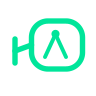
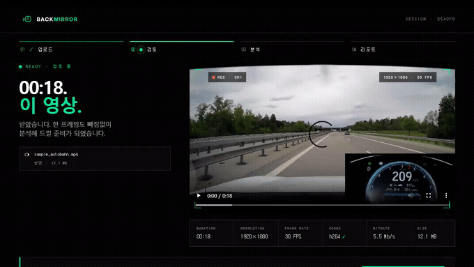
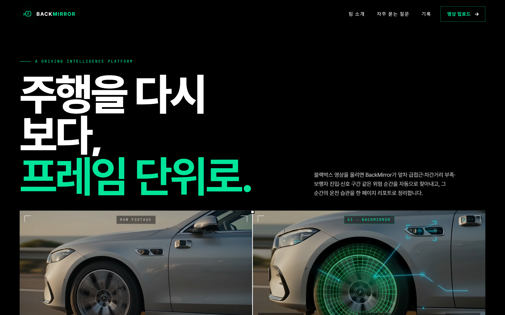
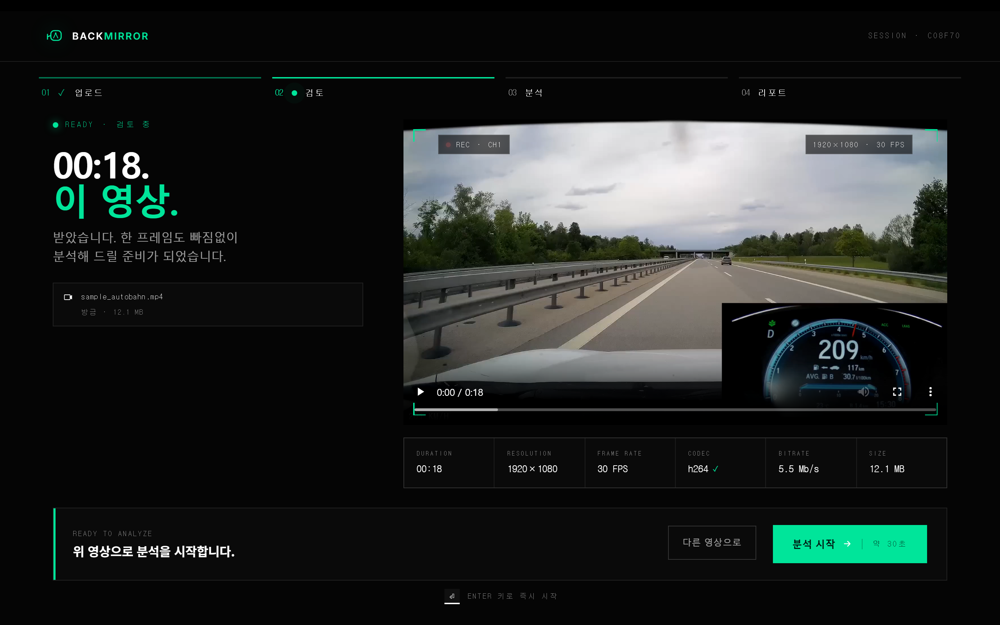
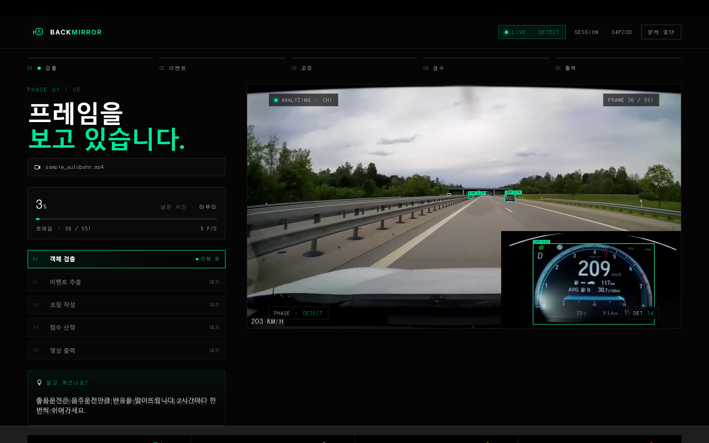
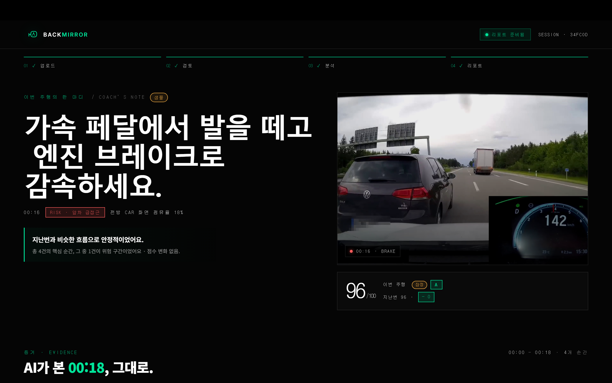
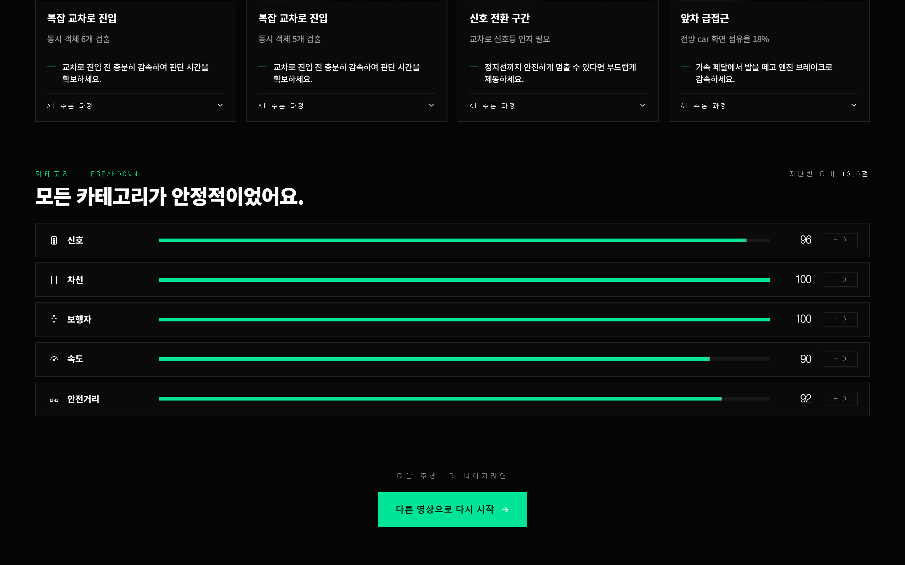

<a name="top"></a>

<div align="center">



# BackMirror

### 블랙박스 영상 한 편을, 한 페이지 운전 리포트로.

**YOLO** 객체 검출 · **Qwen2.5-VL** 코칭 · 이벤트 기반 하이브리드 분석

<p>


</p>

<p>


</p>

<br>



<sub>업로드 → 라이브 분석 → 점수·코칭 리포트까지. 위험 순간을 프레임 단위로 되짚어 줍니다.</sub>

</div>

---

## 한눈에

블랙박스 영상은 쌓여만 가고, 정작 **내 운전 습관은 아무도 말해주지 않습니다.** BackMirror는 영상 한 편을 받아 —

- 🔍 **프레임마다 객체를 검출**하고 (차량·보행자·신호등·차선…)
- ⚠️ **위험 순간만 골라내** (앞차 급접근 · 보행자 진입 · 신호 변화 · 복잡 교차로)
- 🗣️ 그 순간을 **VLM이 사람 말로 코칭**해 줍니다 (상황 → 위험 → 행동)

결과는 점수 한 줄 평가 + 타임라인 + 키 모먼트 + **주석이 입혀진 영상**으로 정리됩니다.

> *"YOLO+VLM 조합은 좋다. **진짜 사용할 것 같은 앱**을 만들어라."* — 교수님

---

## 🎬 화면 미리보기

업로드 → 검토 → 라이브 분석 → 시네마틱 리포트의 **4-state 흐름**.

<table>
<tr>
<td width="50%"><br><sub><b>① IDLE</b> · 에디토리얼 랜딩</sub></td>
<td width="50%"><br><sub><b>② UPLOADED</b> · 영상 검토 + 메타데이터</sub></td>
</tr>
<tr>
<td width="50%"><br><sub><b>③ ANALYZING</b> · 라이브 bbox + HUD + 파이프라인</sub></td>
<td width="50%"><br><sub><b>④ RESULTS</b> · 점수 · 코칭 · 주석 영상</sub></td>
</tr>
</table>

<details>
<summary>📊 결과 리포트 상세 — 키 모먼트 카드 + 카테고리 점수</summary>

<br>



</details>

---

## 🚀 빠른 시작

```bash
pip install -r requirements.txt
python app.py
# → http://127.0.0.1:7865
```

기본은 **목(mock) 데이터**로 동작하므로 GPU·가중치 없이도 전체 흐름을 바로 볼 수 있습니다.

<details>
<summary>영상 없이 파이프라인만 검증 / 스크린샷·GIF 재생성</summary>

<br>

```bash
# 합성 영상으로 5단계 파이프라인 전체를 단독 검증
python scripts/smoke_pipeline.py

# README 시각 자료 재생성 (app.py 가 떠 있는 별도 터미널에서)
pip install playwright && python -m playwright install chromium
python scripts/capture_screens.py     # → docs/img/0*.png (4-state 스크린샷)
python scripts/record_demo_gif.py      # → docs/img/results.gif (결과 화면 GIF)
```

</details>

---

## 🏗️ 동작 원리 — 4-Phase 이벤트 기반 분석

영상 전체에 무거운 VLM을 돌리는 대신, **검출 → 룰 기반 이벤트 → 이벤트에만 VLM**으로 비용을 압축합니다.

```
Phase 1 · YOLO 전체 스캔 ──────────── core/detector.py
          프레임별 객체 검출 → FrameDetections 리스트

Phase 2 · 이벤트 추출 (rule-based) ── core/event_extractor.py
          bbox 크기 / 보행자 위치 / 신호 변화 / 객체수 급증 → Event

Phase 3 · VLM 코칭 (이벤트만) ─────── core/vlm.py
          DriveVLM-style 3-stage CoT:
            ① Scene description  ② Scene analysis  ③ Action plan

Phase 4 · 종합 ──────────────────── core/scorer.py + core/overlay.py
          카테고리 점수 + Grade + Focus area + 주석 영상 (PIL 한글 텍스트)
```

> 💡 VLM은 영상당 **5~10회**만 호출 → 실시간성과 코칭 품질을 동시에 확보.

모든 모듈은 [`core/schema.py`](core/schema.py)의 dataclass를 공통 contract로 주고받습니다.

<p align="right"><a href="#top">▲ 맨 위로</a></p>

---

## 🔧 팀원 교체 지점

실제 모델이 준비되면 **딱 두 곳만** 구현하면 됩니다. 다운스트림(이벤트 → 스코어 → UI)은 `schema.py` 시그니처만 지키면 영향받지 않습니다.

<table>
<tr><th>담당</th><th>교체 함수</th><th>활성화</th></tr>
<tr>
<td><b>이지원</b><br><sub>Detection</sub></td>
<td><code>core/detector.py</code><br><code>_detect_real_frame()</code><br><sub>YOLO26n / RT-DETR</sub></td>
<td><code>USE_REAL_YOLO=1 python app.py</code><br><sub>입력 <code>frame: np.ndarray(BGR)</code> → 출력 <code>FrameDetections</code>, 클래스는 <code>CLASS_NAMES</code> 9종</sub></td>
</tr>
<tr>
<td><b>김두훈</b><br><sub>VLM</sub></td>
<td><code>core/vlm.py</code><br><code>_generate_real_coaching()</code><br><sub>Qwen2.5-VL</sub></td>
<td><code>USE_REAL_VLM=1 python app.py</code><br><sub>3-stage CoT 출력 <code>Coaching</code> (scene_description / scene_analysis / action_plan)</sub></td>
</tr>
</table>

**VLM 3단계 프롬프트** (DriveVLM 차용) — `event.type`을 컨텍스트로 넘겨 해당 위험에 집중시킵니다:

1. **Scene Description** — *"이 프레임의 도로 상황을 한국어로 묘사하라"*
2. **Scene Analysis** — *"초보운전자 관점에서 위험 요소를 분석하라"*
3. **Action Planning** — *"운전자가 즉시 취할 행동을 3단계로 제안하라"*

---

## 🎨 디자인 시스템

전체 다크 시네마틱 톤 + signal-green(`#00E59A`) 단일 강조 색.

| | |
|---|---|
| 폰트 | Pretendard Variable (한글 본문) · Inter (UI 라벨) · JetBrains Mono (수치·HUD) |
| 색 팔레트 | `#000` bg · `#00E59A` signal · `#FFB547` amber · `#FF5C5C` risk |
| 카테고리 tier | ≥85 `#0F6E56` · 70–84 `#854F0B` · <70 `#993C1D` |
| CSS | `ui/landing.css` 단일 파일 (디자인 토큰 → 컴포넌트 룰, 2,600줄) |
| 점수 코멘트 | 90+ *"정말 안정적이었어요"* · 80s *"아쉬운 순간이 있었어요"* · 70s *"주의할 점이 발견됐어요"* · <70 *"개선이 필요한 구간이 많았어요"* |

<sub>각 화면은 단일 HTML 블롭으로 렌더되고(Gradio flex/grid 충돌 회피), 영상·버튼만 컴포넌트로 살아남아 JS 브릿지로 연결됩니다. 채점 기준 대응: 학습데이터 30(BDD100K+COCO, 9 classes) · CNN 30(YOLO26n vs RT-DETR + 증강 ablation) · SW 20(본 앱) · 분석 20(최종 PPT).</sub>

---

## 📁 폴더 구조

```
.
├── app.py                  # 4-state Gradio 앱 + DC_BOOT_JS 브릿지
├── core/
│   ├── schema.py           # 모든 모듈 공통 데이터 contract
│   ├── detector.py         # ⚙️ YOLO 교체 지점 (이지원)
│   ├── vlm.py              # ⚙️ Qwen2.5-VL 교체 지점 (김두훈)
│   ├── event_extractor.py  # rule-based 이벤트 추출
│   ├── scorer.py           # 카테고리 점수 + Grade + Focus area
│   ├── overlay.py          # bbox + HUD + alert (PIL 한글 텍스트)
│   └── video_utils.py      # 브라우저 호환 H.264 트랜스코드
├── ui/
│   ├── theme.py            # 디자인 토큰 + CSS 로더
│   ├── landing.css         # ⭐ 전체 디자인 시스템 (2,600줄)
│   └── screens.py          # 4개 화면 HTML 생성기
├── mock_data.py            # 가짜 YOLO bbox + 한국어 코칭 (테스트용)
├── scripts/                # smoke 검증 · 스크린샷/GIF 캡처
├── assets/                 # hero/샘플 영상
└── docs/img/               # README 시각 자료
```

---

## 🗺️ 확장 로드맵

- 보험사 연계 **UBI**(Usage-Based Insurance) 점수 데이터
- 한국 블랙박스 보급률 **88.9%(세계 1위)** → 시장 잠재력
- 운전면허 학원 **B2B**
- **TTS** 실시간 음성 코칭
- **모바일** — DEVA 22~30 FPS 실증 기반

---

<div align="center">

### Team BackMirror

**이지원** · Detection &nbsp;|&nbsp; **박준형** · UI/UX &nbsp;|&nbsp; **김두훈** · VLM

<sub>FVE3011 자동차인공지능 Term Project</sub>

<sub>참고 — DriveVLM (Tsinghua, 2024) · DriveVLM-Dual (2024) · DEVA (2024) &nbsp;·&nbsp; UI 영감: Tesla / Nauto / Motive</sub>

<p><a href="#top">▲ 맨 위로</a></p>

</div>
